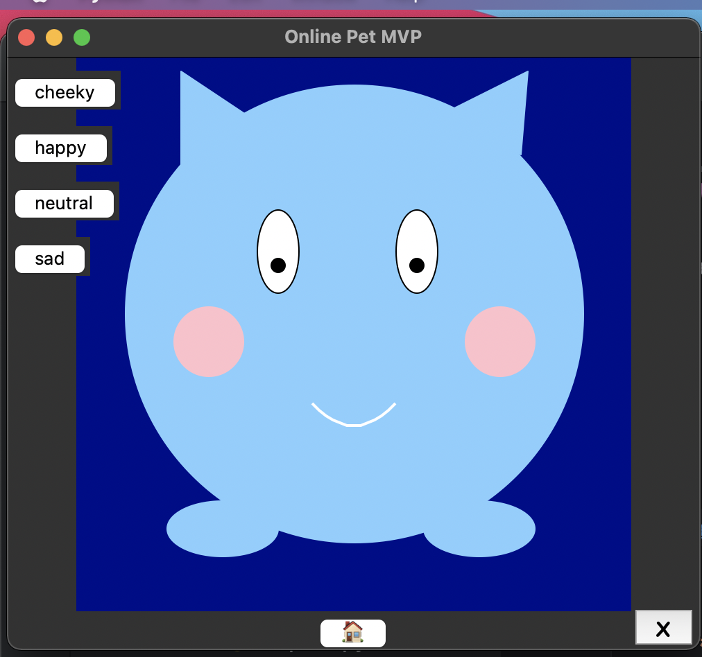

# Sarah Haq's Tech Basic II Exam project

This repository contains my Tech Basics II Exam Project code. I have built a MVP for an Online Pet App:

- When you run the `app.py` you are greeted with a homepage, which has two buttons - one for a new user and one for the returning user.
  - If this is the users first time on the app, then they will click on the new user button and register some information. This is data is stored in a .csv file. For this MVP I am sharing my test users data, but data privacy will be extremely important when I launch my app.
  - If this the user has already registered, they can go to the returning user page and login with their information.
- Once a user registers or successfully logs in, they will be taken to the Online Pet Page where the pet changes based on the mood the user selects.



---
**Your** exam project repository should contain the following:
- Your report as a pdf file.
- Your python code `app.py` that carries out all the steps to build you MVP and if you are using any helper scripts, this should be placed in a separate folder.
- Any images/music or supporting files. Please store this is a separate folder. 
- A README file. This a markdown file that introduces and explains the projects. I am just expecting you to update the header and a few lines on what to expect in your repository. However, if you want to do more, check out this resource [here](https://www.makeareadme.com/).


The `helpers.py` python script in the src folder contains two definitions that might be handy for you - clearing the widgets and placing a background image.

---
## Instructions to run my GUI
This is just for reference, and as mentioned above, you don't need to write detailed README files.

1. Clone my repository in a location of your choice
```
git clone https://github.com/shaq31415926/python_tech_basics
```
2. You should my repository in your directory. You can change the directory in your terminal to where the cloned code is located:
```
cd python_tech_basics/tech_basics_two/13Lecture
```

3. If you have activated a virtual environment, or it is your first time working with these libraries, you will need to install [pandas](https://pandas.pydata.org/docs/reference/general_functions.html) and [pillow](https://pypi.org/project/pillow/):


Mac:
```
pip3 install pandas pillow
```
Windows:
```
pip install pandas pillow
```

4. Run the code

Mac:
```
python3 app.py
```
Windows:
```
python app.py
```

